# AI, movement, and animation runtime

> **Function names verified (2026-09-26).** Every `WINDREAM.EXE` function this page names is in [`re/names/WINDREAM.EXE.tsv`](../re/names/WINDREAM.EXE.tsv) with two independent sources (these docs and a blind review of the decompilation) and facts checked against the binary by `tools/check_names.py`.

Retail-binary trace of how a project actor becomes an animated character, how
the actor AI chooses actions, and how action numbers reach `.DAN` clips.
Addresses are virtual addresses from Disc 1 `WINDREAM.EXE`, image base
`0x400000`. Claims marked **[verified]** are static observations in the shipped
executable or game data. Action names remain **[unverified]** where the files
and code store numbers rather than labels.

## Runtime shape

```mermaid
flowchart LR
    DAT["DREAMS.DAT project + OBJET records"] --> Spawn["SCENE_LoadLevel / ENT_InstantiateFromObjet"]
    Spawn --> Actor["Runtime actor and AI fields"]
    Actor --> Schedule["AI_TickSquads AI scheduler"]
    Schedule --> Decide["target, range, and random action choice"]
    Decide --> Request["actor +0x160 requested action"]
    Request --> Resolve["ANIM_ApplyPendingState state-to-clip lookup"]
    Resolve --> Clip["model-family slot AN###"]
    Clip --> Pose["skeletal pose, blend, and root translation"]
    Pose --> Physics["movement and collision update"]
    Pose --> Event["animation-time effect event"]
    Event --> Shot["effect actor class 0x14"]
    Shot --> Hit["collision and damage"]
```



The game has a central actor updater and a separate AI scheduler. AI requests a
numbered action through the same actor state fields used by player actions; the
animation system resolves that number in the actor's loaded model family. The
executable contains transition tables for AI modes and a separate per-model
action-to-clip table. **[verified]**

## Direct answers

- **Movement-to-animation table:** yes. `0x004f7728` is a 16-family × 64-action
  table mapping requested action numbers to loaded `AN###` clips, with per-slot
  playback flags.
- **AI chain/schedule:** yes. `AI_BuildSquads` (`0x4115a1`) groups eligible actors into
  runtime controllers, and `AI_ApplySquadOrderTable` (`0x41208f`) applies a project-selected mode
  transition list.
- **AI layer:** in `WINDREAM.EXE`, the per-frame dispatcher is `AI_TickSquads` (`0x415109`);
  target collection and decisions run in `AI_ScanNearbyActors` (`0x4131a4`), `AI_UpdateMemberStatus` (`0x414d61`), and
  `AI_TickCombat` (`0x414646`).
- **NPC firing:** Project54's `IBI.DAN` is a concrete retail match: its target
  AI requests actions that resolve to `IBIAN016`; an animation-timed handler
  launches a moving effect whose collision path applies damage.

## AI schedule and actor chains

### Per-frame scheduler

`GAME_Tick` (`0x4240ba`) calls `AI_TickSquads` (`0x415109`). The scheduler walks several active actor
lists in a fixed order: **[verified]**

| List | Count | Pass | Observed role |
|---|---|---|---|
| `0x005df3ec` | `0x005df474` | `AI_ApplySquadOrderTable` (`0x41208f`) | Apply project-selected actor mode transitions. |
| `0x005df3ac` | `0x005df470` | `AI_DispatchSquadOrders` (`0x413b3b`) | Update linked or grouped AI actors. |
| `0x005df42c` | `0x005df46c` | `AI_RunMemberOrders` (`0x414b24`) | Run per-actor steering and action decisions. |
| `0x005df42c` | `0x005df46c` | `AI_UpdateMemberStatus` (`0x414d61`) | Refresh actor candidate and target state. |
| `0x005df3ac` | `0x005df470` | `AI_AggregateSquadStatus` (`0x414f6d`) | Aggregate status from linked actors. |

AI group-controller records store a linked-member count at `+0x19c` and member
pointers beginning at `+0x1a0`. `AI_AddSquadMember` (`0x410f03`) increments that count, appends a
member pointer, and stores the controller back-pointer on the member at
`+0x1ac`. The controller's mode is at `+0x1b4`, previous mode at `+0x1bc`,
status bits at `+0x1b0`, and current target at `+0x1d0`.
**[verified]**

`AI_BuildSquads` (`0x4115a1`) builds the lists on scene load, and it is re-run
from `GAME_Tick` (`0x4240ba`), `0x41e5af`, the trigger tick `SCENE_TickTriggers`
(`0x429061`), and the hit resolver `ENT_ApplyAttackHit` (`0x4440aa`). It scans the 32 project-actor
slots, filters active/eligible actors, separates them by actor flag `+0xa9`
bit `0x20`, and groups each class in batches of up to three. The
`0x005df3ec` and `0x005df3ac` arrays hold controller records; `0x005df42c`
holds member actors. `AI_ResetSquadNode` (`0x410e5d`) initializes both record types. **[verified]**

`AI_RunMemberOrders` (`0x414b24`) selects work from bits in the mode word: bit `0x10` runs the
look/steering path, bit `0x02` runs the general behavior path, and bit `0x04`
runs the target action selector `AI_TickCombat` (`0x414646`). `AI_DispatchSquadOrders` (`0x413b3b`) applies mode
changes across an actor's linked members. **[verified]**

### Executable transition lists

`AI_ApplySquadOrderTable` (`0x41208f`) selects a transition list from a pointer array at `0x0049d5a0`,
using the project header value at `+0xd0`. It compares the controller's current
mode and status bits, then changes that mode. Each row is three integers:

```text
current AI mode, required status-bit mask, next AI mode
```

The current retail `DREAMS.DAT` uses selector 0 in 143 projects and selector 1
in 7 projects: 28, 57, 78, 90, 117, 130, and 146. The executable also contains
a third list (selector 2), which no retail project selects. **[verified]**

| Selector | Transition rows (`from`, required `+0x1b0` bits, `to`) |
|---:|---|
| 0 | `(0x50, 0x000, 0x40)` |
| 1 | `(0x00, 0x000, 0x01)`, `(0x01, 0x800, 0x20)`, `(0x20, 0x040, 0x01)`, `(0x01, 0x004, 0x10)`, `(0x10, 0x400, 0x00)` |
| 2 | `(0x00, 0x000, 0x01)`, `(0x01, 0x800, 0x20)`, `(0x20, 0x040, 0x02)`, `(0x02, 0x004, 0x10)`, `(0x10, 0x400, 0x00)` |

The selector is a project-level schedule choice, while mode and status live on
each runtime actor. This is the recovered AI transition list; it is compiled
into the executable rather than stored as a named script file. **[verified]**

### Target selection and attack-like actions

`AI_ScanNearbyActors` (`0x4131a4`) builds candidate lists from active actors. It sorts them by a
distance metric and keeps at most five. It uses actor group flags, a
facing-angle window, and the actor's configured range. Candidate pointers are
stored at actor `+0x1dc` and `+0x1f0`, with counts at `+0x204` and `+0x208`.
`AI_UpdateMemberStatus` (`0x414d61`) checks the candidate set and assigns the selected actor pointer
to `+0x1d0`; one path requires a helper result below 600. The helper's unit and
full meaning remain unresolved. **[verified condition; helper interpretation open]**

`AI_TickCombat` (`0x414646`) uses the selected target, distance, facing, and a random
threshold to request numbered actions. Its attack-like branch chooses among
state IDs `0x10`, `0x14`, `0x12`, and `0x16`. It also requests state `0x39` when
its collision test succeeds and state `0x1c` on a separate timed path.
`ANIM_RequestState` (`0x405118`) places these requests in actor `+0x160`; the ordinary actor
update later resolves and applies them. **[verified]**

The source object fields feed those checks: `OBJET +0x78` is copied to runtime
actor `+0x118`, which the decision code squares for a target-distance limit;
`OBJET +0x88` is copied to `+0x194`, used as a random-action threshold.
**[verified]**

### Project54 `IBI.DAN`: firing path

Project54 is *Exterieur Armee*. Its `OBJET1` is `IBI.DAN`, the only retail
`OBJET` with behavior selector 5. Its record sets `+0x70 = 585`, `+0x78 = 6250`,
and `+0x88 = 20`. Its flags word is `0x1247` (byte `+0x35 = 0x12`); that byte's
`0x10` bit maps to actor `+0xae & 0x02`, which gates the target-action path.
`ENT_InstantiateFromObjet` (`0x41deb8`) remaps selector 5 to runtime class 1 and sets actor flag
`+0xad & 0x20`; it also copies the three parameters to actor `+0x10c`, `+0x118`,
and `+0x194`. **[verified from Disc 2 `IBI.DAN` and retail `DREAMS.DAT`]**

IBI has clips `AN000`, `AN002`, `AN016`, `AN050`, and `AN057`. The AI branch
requests states 16, 20, 18, or 22. `ANIM_LoadEntitySet` (`0x404d98`) backfills missing slots from
the nearest earlier loaded clip, so all four requests resolve to `IBIAN016`
(82 frames). The separate collision branch requests state 57, which resolves
to `IBIAN057` (82 frames). **[verified]**

The shot effect is synchronized to the attack animation. `ENT_TickEntity` (`0x407b51`) calls
`ENT_SpawnAttackObject` (`0x442944`) when the attack state's frame threshold is crossed. The effect
builder allocates a transient actor; IBI's `+0xad & 0x20` flag makes it effect
class `0x14`. `ENT_PlaceAtFacingOffset` (`0x442786`) writes the owner's facing
vector scaled by `+0x10c` (IBI's value 585) into the effect's `+0x18`/`+0x1c`/`+0x20`
and sets the effect's position to the owner's position plus that vector (with a
constant Y offset from `0x4c585c`); it is a general helper that `0x419a3e` and
`SCENE_TickTriggers` (`0x429061`) also call. `ENT_MoveAttackObject` (`0x442e0d`) advances effect classes other than `0x10` by their
velocity. `ENT_TickAttackObject` (`0x444b8f`) is the per-tick update of an attack
object, called from `ENT_TickAll` (`0x407089`), and includes its collision test; for class `0x14`,
`ENT_ApplyAttackHit` (`0x4440aa`) calls `ENT_ApplyDamage` (`0x443619`) to reduce the target's health at `+0x38` by
10 and request its hit/death state. **[verified]** This confirms the target-
driven animation emits a damaging moving projectile effect.

This is the recovered NPC firing sequence: the IBI controller requests one of
four numeric attack states, each resolves to `IBIAN016`, and the animation
event launches a damaging moving effect. The engine contains no clip label or
effect name that calls this a fireball; the exact visual/effect resource
identity is still open. **[verified sequence; effect label unverified]**

### `OBJET` fields: verified runtime use and limits

`ENT_InstantiateFromObjet` (`0x41deb8`) creates an actor from a project's `OBJET` record. **[verified]**

| `OBJET` offset | Runtime use observed |
|---:|---|
| `+0x34` | Flag word. Its low bits control active/character behavior; it is not an entity-kind enum. |
| `+0x64` | Copied to actor `+0x34` as a behavior/class selector. Values 5 and 6 are remapped to runtime classes 1 and 3, with extra flags. |
| `+0x68` | Copied as a movement scale to actor `+0x104`. |
| `+0x6c` | Copied to actor `+0x108`, the **turn step**: `ANIM_RequestState` (`0x405118`) turns by it (default `0x30` of 4096 per turn, ¾ of it outside combat stance `+0xac & 0x20`). Not a `BOX` index. **[verified]** 2026-09-26 |
| `+0x70` | Copied to actor `+0x10c`: the walker's **collision-sphere radius** (`PHYS_AttachActorCollider` (`0x40bedb`)), also used as the facing-offset magnitude for attack effects by `ENT_PlaceAtFacingOffset` (`0x442786`). |
| `+0x78` | Target-distance parameter copied to actor `+0x118`. |
| `+0x88` | Random-action threshold copied to actor `+0x194`. |

This corrects the earlier `project.py` comment that treated `+0x6c` as a local
`BOX` route index. Retail values such as 63, 113, and 128 exceed the 0–11 `BOX`
slot range. The records do include `BOX` point geometry, but a direct actor-to-
`BOX` route link has not been found. **[verified field mapping; unresolved use]**

## Action state to animation clip

### Per-model action table

The runtime table at `0x004f7728` has 16 model-family banks × 64 action slots.
Each 16-byte slot contains a loaded clip handle and state flags. **[verified]**

- `ANIM_InitStateTable` (`0x40484d`) initializes the slots and assigns shared per-action flags.
- `ANIM_LoadEntitySet` (`0x404d98`) loads a model's `.DAN` directory, parses each `AN###` suffix,
  and installs the clip handle at that numeric slot in the model's family bank.
- Missing slots are filled from the preceding available slot. The family is
  stored on the actor at `+0x158`.
- `ANIM_ApplyPendingState` (`0x4058d5`) resolves the requested action in `+0x160` as a slot within the
  actor's family, commits it as the current action at `+0x15c`, and starts a
  transition if the resolved clip changes.

There is no textual “walk → clip 18” dictionary. The executable uses numeric
action states and the matching numeric `AN###` clip slot. The shared flag byte
at each slot affects playback and transitions; not every flag bit has been
given a reliable semantic name.

### Player movement

`SCENE_InitLevel` (`0x41f42e`), which `SCENE_LoadLevel` (`0x41f9db`) runs on
every level load, loads the player bank from `XH_.DAN` (or `MHE.DAN` for the
alternate character) through `ENT_LoadObject` (`0x41d624`) and `ANIM_LoadEntitySet`,
requests state 0, and enters the same resolver. **[verified]**

For runtime class 1, `ANIM_ApplyPendingState` (`0x4058d5`) selects an action from actor `+0x240`
divided by frame delta. `+0x240` is the **vertical** velocity (Y points down)
of the physics vector `+0x238/+0x240/+0x248`, and the test only runs while
the actor is **airborne** (`+0x278` bit 0) and player-controlled (`+0xa8 & 4`,
disassembly `0x405b98`–`0x405c5c`). These are **falling** states, not walk and
run speeds (correction 2026-09-26): **[verified]**

| Downward speed `+0x240 / Δt` while airborne | Requested state | `XH_.DAN` slot |
|---:|---:|---|
| below 1, or not airborne | 0 | `AN000` |
| 1 to below 20 | `0x29` (41) | `AN041` |
| 20 to below 45 | `0x19` (25) | `AN025` |
| 45 or above | `0x2a` (42) | `AN042` |

The camera treats the same three states with the airborne bit as falling
(orbit camera), and the flying controller leaves flight into state `0x19` with
a downward speed of `20/Δt`. Walking and the other player actions come from
the controls through `ANIM_RequestState` (`0x405118`); see *Player controls* below.

### Player controls **[verified]**

Traced 2026-09-26. Keys reach the game as eleven **action words**
(`0x49d2fe`–`0x49d326`), filled each frame by `INPUT_UpdateActions` (`0x40dce4`) from the
`GetAsyncKeyState` table at `0x6308d8` (indexed by Windows virtual-key code)
or, on joystick devices, from the axes and two buttons. Bit 0 is held, bit 1
the press edge, bit 2 the change edge (directions also auto-repeat every 40
ticks).

| Action word | Key (VK) | Joystick |
|---|---|---|
| `0x49d2fe` | ↑ (`0x26`) | Y− |
| `0x49d302` | ↓ (`0x28`) | Y+ |
| `0x49d306` | ← (`0x25`) | X− |
| `0x49d30a` | → (`0x27`) | X+ |
| `0x49d316` | Alt (`0x12`) | button 1 |
| `0x49d31a` | Ctrl (`0x11`) | button 2 |
| `0x49d30e` | Space (`0x20`) | — |
| `0x49d312` | Esc (`0x1b`) | — |
| `0x49d31e`/`322`/`326` | 1 / 2 / 3 | — |

Alt + 5, 6, 7, 8, 9, 0 select the camera presets (`GAME_HandleHotkeys` (`0x415aa7`));
Insert turns the arrows into look keys. The same words are what the demo
recorder stores.

**Per frame** (`ENT_TickPlayerControl` (`0x423767`), from `GAME_Tick` (`0x4240ba`)): the player scans for enemies
within 800 units (1,500 or 2,500 with a drawn weapon; there are three
weapons, tested by `ENT_IsSwordDrawn` (`0x441160`), `ENT_IsBowDrawn` (`0x441726`) and
`ENT_IsGunDrawn` (`0x441cb2`)); an enemy in range sets the **combat
stance** `+0xac & 0x20` for at least 60 Δt units. It then runs one
controller by movement mode `+0x34`: ground (1) `ENT_TickPlayerGround` (`0x421717`), swimming (2)
`ENT_TickPlayerSwimming` (`0x422af2`), flying (3) `ENT_TickPlayerFlying` (`0x422cd7`).

**Ground** (outside combat stance), in priority order:

| Input | State requested |
|---|---|
| ← / → held | `0x3d` / `0x3c` (turn) |
| Esc press | `0x18` when no weapon is drawn (the pick-up state) |
| 1 / 2 / 3 press | select slot; message `0x44` 0/1/2 |
| 1 / 2 / 3 release with an item | cast it: `0x1c`, `0x1e`, `0x1f`, `0x20` or `0x21` by item id, if magic `+0x3c` covers the cost (`0x442431`); else message `0x45` |
| Ctrl press near an object | `0x18`, the object goes to the inventory (`0x42a182`) |
| Alt + Ctrl + ↓, grounded | `0x30` |
| Ctrl, grounded | `0x23` beside an enemy; with ↓ `0x2e` |
| Ctrl press, grounded | jump: `9`; `10` when `+0xac & 1`; `0xb` from a forward walk with ↑ |
| Alt + Ctrl press, flight-capable (`+0xab & 2`), magic > 4, ↑ | take off: state 8, mode 3 |
| ↑ held | walk: `4` (`0x2c`/`0x2d` with a weapon) |
| ↓ held, grounded | `0x1a` (step back) |

In combat stance Alt attacks chain `0x10 → 0x12 → 0x14` (and
`0x16 → 0x15 → 0x11` with Ctrl) when the current clip is far enough along,
weapons swap in `0x36`/`0x37`/`0x3a`, ↑ is `0x17`, ↓ `0x2e`, and the
flight-capable form fires (`5`, `ENT_SpawnAttackObject` (`0x442944`)) at a magic cost of
`0.05 · Δt` per frame.

**Swimming**: ←/→ `0x3d`/`0x3c`, ↑ `0x24`, ↓ `0x26`, Alt picks up and plays
`6`/`7`. **Flying**: the same four directions (↑ only after a 45-unit
take-off countdown), Alt and Ctrl attacks; magic drains by `0.04 · Δt` per
frame. Out of magic, or on an impact > 64, the controller requests state
`0xe`, which ends the flight: mode back to 1, airborne, state `0x19` with a
downward speed of `20/Δt`.

**Turning** (`ANIM_RequestState` (`0x405118`), states `0x3c`/`0x3d`): the turn step is `0x30` (or
the actor's `+0x108`, from OBJET `+0x6c` or level `+0xa4`), ¾ of it outside
combat stance, 0 when `+0xb1 & 4`. Each request adds `step · 12 / 32` (scaled by
the frame) to the yaw rate `+0x60`, capped at `±100 · Δt`, and
`ENT_TickEntity` (`0x407b51`) adds the rate to the heading `+0x5c` every frame (4096 per
turn). Flyers also bank (`+0x64`) and pitch (`+0x6c`) the same way.

**Speed** comes from the clips. Each frame the actor's velocity is pulled
toward the clip's root-motion delta (`+0x18..+0x20`) with weight `s/128`:
`v = v·(128 − s)/128 + root·s/128`, where `s` is the movement scale `+0x104`
(default 16; level record `+0xa0` on the ground, `+0xd8` swimming, `+0xdc`
flying). Physics then steps by `v` (engine.md, *Collision and physics*).

**Landing** (ground controller, before anything else): with an impact > 1 and
last frame's downward speed `s = v_y / Δt`: > 60 deals 5, > 100 +10, > 120 +15,
> 180 +40, > 250 +100, and > 90 knocks the player down (state `0x27`) if
still alive. A flying player takes 2 when `v_y` > 100 and 1 for an impact
> 64. See engine.md, *The fixed step*, for why this depends on Δt.

**Level exits** (`SCENE_CheckExits` (`0x420b60`), eight LINK records, file-formats.md): a
link fires when the player (or any actor, flag `0x80`) is inside its box — or
at once when the box is empty — and its conditions hold: flag 2 no living
enemy of the other faction, 4 the actor's `+0x1d4` partner flagged `+0xac &
0x10`, `0x10` the level's trigger-completion flag, `0x20` Ctrl pressed, and a
named object held (or, with flag 8, not held). It then starts a 15-frame
transition, plays sound 13 and, if the target level names an intro video,
plays it.

The generic actor updater `ENT_TickEntity` (`0x407b51`) advances animation and movement
together. The engine's nominal animation base is 30 frames per second. The
shared clip evaluator blends two channels and feeds root translation into the
movement/collision path; see [animation timing](animation-timing.md),
[root movement and blending](animation-root-blending.md), and the
[animation subsystem](animation-subsystem.md). **[verified]**

## Entity update, action events, spells and inventory **[verified]**

Traced 2026-09-26.

### Update order

`ENT_TickAll` (`0x407089`), once per frame from `GAME_Tick` (`0x4240ba`): the 16 transient objects at
`0x630db8` (free objects `+0xa9 & 8`; attack objects `+0xaa & 1` move and test
hits through `ENT_MoveAttackObject` (`0x442e0d`)/`ENT_TickAttackObject` (`0x444b8f`)); the platform owner and
`PHYS_UpdatePlatforms` (`0x43e115`); then the 32 actors at `0x4fb7a8` (0x2d0 bytes each) with
`+0xa9 & 4`, through `ENT_TickEntity` (`0x407b51`). Removed actors (`+0xab & 4`) go to
`0x41ec38`.

`ENT_TickEntity` (`0x407b51`), per actor:

1. swimming update; heading, bank and pitch += their rates (`+0x60/+0x68/+0x70`),
   then the yaw rate **halves** and the others lose ¼ each frame, and rates below
   a Δt-scaled floor snap to 0; walkers' pitch follows the floor slope
   (`ENT_TiltToSlope` (`0x4079f3`)); bank and pitch relax toward level (1/16 per frame while
   walking, ¼ otherwise);
2. the **action events** below;
3. `ANIM_ApplyPendingState` (`0x4058d5`) (commit the requested action), action sounds, then
   `ANIM_TickClip` (`0x4068be`) (or `ANIM_TickBlend` (`0x405f1f`)/`ANIM_TickSeamlessSwitch` (`0x4062ad`) during a
   transition, which call `PHYS_TickEntity` (`0x43d83e`)), and head tracking (`ENT_TrackTarget` (`0x4071bb`): the
   head node turns toward the current target, clamped to ±45°). A new action's
   clip starts at frame 1 (`ANIM_StartClip` (`0x4067a2`)).

### Action events

When the current clip passes a fixed fraction of its frames, the action
spawns its hit object (`ENT_SpawnAttackObject` (`0x442944`)) with a sound id:

| Action | When | Sound | Extra |
|---|---|---|---|
| `0x10`–`0x12` (attack chain) | ½ (or the actor's `+0x58` time) | `0x16` | |
| `0x13` | its own time | 8 | |
| `0x14`–`0x16`, `0x17` | its own time | `0x16` | |
| `0x36`–`0x38` (weapon) | ½ | `0x15` | |
| `0x39` (aim, alive) | its own time | 0 | |
| `0x3a`, `0x23` | its own time | 5 | |
| `0x1c`/`0x1d` (cast) | ⅗ | `0x13` | effect `0x42c583(2, actor, 0, 50)` |
| `0x1e`/`0x1f` (cast) | ⅔ | `0x12` | same effect |
| `0x20`/`0x21` (cast) | ⅔ | `0x13` | same effect |
| `0x18` after Esc | its own time | — | opens the game menu (`MENU_RunGameMenu` (`0x4337c0`)) |

Movement sounds play on entering: take-off 8 (`0x17`), 2/3 (`0xe`), jumps
9/10/11 (3), walks 4/`0x2c`/`0x2d` (`0xf`), fire 5 (0), swim stroke 6 (1).

### Spells and items

Keys 1, 2, 3 put an item code in slot `+0xe4`, `+0xdc`, `+0xec` (pressing
one clears the other two and posts UI message `0x44` 0/1/2). Releasing the key
uses the item if magic `+0x3c` covers its cost (`ENT_GetMagicAfterCost` (`0x442431`); else message
`0x45`), and the code picks the casting action:

| Code | Cost | Action | | Code | Cost | Action |
|---|---:|---|---|---|---:|---|
| `1` | 20 | `0x20` | | `0x10004` | 60 | `0x20` |
| `2` | 20 | — | | `0x10001`, `0x10003` | 10 | — |
| `4` | 10 | — | | `0x100001` | 50 | `0x1e` (`0x1c` from key 2) |
| `5` | 40 | — | | `0x100002` | 40 | `0x1e` |
| `7` | 60 | — | | `0x100003` | 30 | `0x21` |
| `0x10` | 0 | — | | `0x1000002` | 50 | `0x1f` |
| `0x11` | 20 | `0x1c` (`0x20` from key 2) | | `0x1000004` | 30 | `0x1c` |
| `0x12` | 1 | `0x1c` | | `0x1000005` | 50 | — |
| `0x13` | — | `0x1c` | | `0x1000009` | 15 | `0x1f` |
| `0x14` | 2 | — | | `0x1000010` | 50 | `0x1c` |
| `0x100` | 1 | — | | | | |

"—" in the action column: no casting animation from this controller.

The item names behind the codes are in the spell and object tables of
`DREAMS.INI` (game-content.md); matching codes to names is open.

**Inventory** (`ENT_AddInventoryItem` (`0x42a182`), `ENT_HasInventoryItem` (`0x42a3a3`), `ENT_ResetInventory` (`0x42a448`)): the actor's `+0x30` points to
a 32-slot inventory of 16-byte object names (`+0x04`) with counts (`+0x314`);
picking an object up adds or counts it and posts UI message `0x41`. Level
exits test for a required object by name prefix.

## Firing animation: IBI sequence and remaining effect identity

The AI firing/attack path now has concrete stages:

1. `AI_TickSquads` (`0x415109`) schedules the NPC's mode and target passes.
2. `AI_UpdateMemberStatus` (`0x414d61`) chooses an eligible nearby target.
3. `AI_TickCombat` (`0x414646`) checks target distance, facing, and a random threshold.
4. It requests one of action slots 16, 20, 18, or 22 through `ANIM_RequestState` (`0x405118`).
5. The common resolver maps that action number to the NPC model's `AN016`,
   `AN020`, `AN018`, or `AN022` clip slot.

**[verified control flow]** For the IBI actor in Project54, all four requested
states resolve to `IBIAN016`, then `ENT_TickEntity` (`0x407b51`) triggers the moving effect
through `ENT_SpawnAttackObject` (`0x442944`) / `ENT_PlaceAtFacingOffset` (`0x442786`) / `ENT_MoveAttackObject` (`0x442e0d`); the collision path
applies damage through `ENT_TickAttackObject` (`0x444b8f`) / `ENT_ApplyAttackHit` (`0x4440aa`) / `ENT_ApplyDamage` (`0x443619`). The
remaining check is the effect's visible resource and how collision rules vary
between actor classes; those tables do not supply human-readable names.

## Reproduce the binary trace

```powershell
. .\tools\dreams-env.ps1
& (Join-Path (Get-DreamsSetting DREAMS_GHIDRA_ROOT) 'support\analyzeHeadless.bat') `
  ghidra dreams -process WINDREAM.EXE -noanalysis -readOnly `
  -scriptPath ghidra_scripts `
  -postScript Decompile.java 0040484d 00404d98 00405118 004058d5 `
  00407089 00407b51 00410e5d 00410f03 004115a1 0041208f 004131a4 `
  00413b3b 00414646 00414b24 00414d61 00414f6d 00415109 `
  00442786 00442944 00442e0d 00444b8f 004440aa 00443619
```

The project transition selector is at decompressed `DREAMS.DAT` record `+0xd0`.
The pointer table and rules are at `WINDREAM.EXE:0x0049d5a0`; the action table
is initialized at `ANIM_InitStateTable` (`0x40484d`) and populated at `ANIM_LoadEntitySet` (`0x404d98`).

Selector census, using the parser field added for this finding:

```powershell
. .\tools\dreams-env.ps1
$dat = Join-Path (Get-DreamsSetting DREAMS_DISC1) 'DREAMS.DAT'
uv run python -c 'import sys; from dreams.formats.project import read; print([(p.index, p.ai_schedule_selector) for p in read(sys.argv[1]) if p.ai_schedule_selector])' $dat
```

## Open questions

- Which other ranged actors use the moving class-`0x14` effect, and which
  visible effect asset or damage/collision routine gives it its gameplay name?
- The IBI clip is functionally the attack/launch pose; its authored pose label
  is still absent from the retail clip directory.
- What are the human-readable labels for player movement slots 25, 41, and 42?
- What is the runtime meaning of `OBJET +0x6c`, and which project `BOX` records
  define NPC navigation or patrol paths?
- Which actor mode/status bit meanings can be named from additional retail
  data and call-site tracing?
