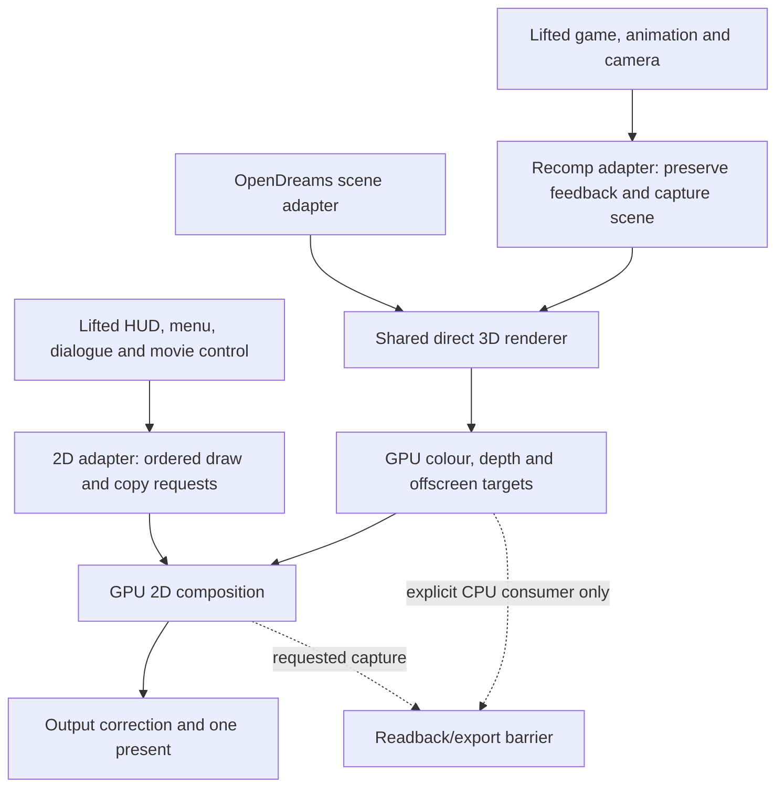

# 006 — Direct 3D and GPU 2D renderer for the recomp

Status: **Live direct first-scene slice implemented; full R0–R4 acceptance
remains partial. Software stays the default reference.**
Date: 2026-09-30.

The renderer is built directly for the modernized frame:

**posed scene -> direct GPU 3D -> GPU sprites/text/UI -> output correction -> present**

The owner has chosen this architecture. A Glide-call wrapper, a software
Voodoo renderer, routine scene readback and a changed-pixel overlay are not
implementation stages. The existing software recomp and original game remain
independent comparison tools. No production renderer integration is complete;
the existing CPU/GPU smokes establish only their recorded contracts.

Dependencies and evidence:

- [000: the recomp](../000-the-recomp/spec.md), [north star](../../north-star.md).
- [3D boundary and smoke evidence](modern-cut.md).
- [2D function/address map, contracts and smoke evidence](2d-cut.md).
- [Implementation status, interfaces and validation](implementation.md).
- [Demo-informed retail layouts, boundary and type-2 lighting](debug-renderer-contracts.md).
- [Glide appearance rules](../../glide-renderer.md),
  [Glide call inventory](../../glide-call-inventory.md),
  [engine](../../engine.md), [port-map policy](../../../opendreams/PORT_MAP.md).
- [Historical backend exploration](backend-exploration.md): the three-build
  comparison, original backend slots and alternative approaches.

This file is the implementation authority for 006. The companion investigations
retain their evidence and limitations; their earlier staging suggestions are
superseded wherever they conflict with this decision.

## Decisions

| Area | Selected design |
|---|---|
| Renderer | A shared direct renderer built on sokol_gfx; SDL3 remains the platform layer |
| Sharing | Extract the required rendering core from existing shared rendering code; OpenDreams and the recomp supply separate input adapters |
| 3D boundary | Before retail visual culling, clipping and integer projection; consume original geometry, posed transforms, camera, materials and lighting state |
| Visual ownership | The modern renderer owns geometry processing, visibility, projection, clipping, shading, fog, transparency and rasterization, including offscreen 3D |
| 2D boundary | Replace pixel-producing leaves and classified surface fills/copies; keep lifted layout, selection, formatting, timing and control flow |
| Normal frame | GPU 3D, GPU UI composition, one present; no recurring framebuffer download |
| Resolution | Render the scene at drawable/internal resolution from the first integrated slice; target size is a parameter, not hard-coded to 640x480 |
| Aspect | Hor+ widescreen: retain original vertical FOV and reveal more at the sides; retain a 4:3 comparison view |
| UI layout | Center the original logical 4:3 layout/artwork over the wider scene; keep proportions and map input through that same canvas; preserve movie aspect |
| Appearance | Retain recovered material, palette, fog, depth and ordering rules; preserve tested integer 2D arithmetic |
| Display correction | Apply gamma/output correction after 3D and UI composition |
| Colour precision | Correction-free RGBA8 scene targets; quantize only where a packed-pixel operation requires it, leaving untouched 3D pixels at modern precision |
| Readback | Explicit CPU output or diagnosed compatibility barrier only; never the ordinary bridge from 3D to UI |
| Platforms | D3D11, Metal, GL core and WebGL2; one shader/core design, validated per backend. Remaining recomp OS/runtime portability is separate work |

Windows/D3D11 gameplay is the first delivery gate. The shared renderer is then
validated independently on Metal, GL core and WebGL2 in R4; unavailable hardware
is recorded as unvalidated, never counted as a runtime pass from shader generation.

Direct rendering does not mean changing the artwork, lighting style, animation
system or game rules. It also does not require every renderer calculation to
be a GPU kernel: CPU packet preparation or visibility inside the new renderer
is an implementation choice. Visual ownership and independence from the old
projected/culled output are the requirements.

## What stays with the game

Keep resource loading/relocation, entity state, animation evaluation, camera
gameplay, collision, sound, palette-state updates and RNG consumption lifted.
Keep HUD/menu/dialogue/movie decisions and logical layout lifted. CPU movie
decoding and generation of sprite/palette data produce uploads; they do not
require scene downloads.

One renderer-era side effect is especially important: node `+0x4c` contains a
camera-space position read by sound and line-of-sight code on the following
game update. Preserve its original arithmetic, visitation and timing, including
stale values in skipped subtrees. The validated transform helper can perform
the compatibility composition without rendering. This belongs to the
game-facing adapter, not to the display camera or interpolation path.

The retained hierarchy walk may perform that update and collect scene input.
It must not invoke the old visual culling/projection/shading tail. The renderer
must not use the gameplay feedback fields as its authoritative visual pose:
pass local/posed transforms and camera separately, with an explicit coordinate
space contract. Apply the camera once. Do not add an authored-root transform
or reinterpret encoded pointer `1` as null.

Account for frame callbacks, scratch lifetime, node-box/debug outputs and the
diagnostic collector branch at their actual callers. Preserve or explicitly
replace their contracts; do not discard them when bypassing the pixel backend.
In particular, retain collision separation in `GAME_DrawFrame`.

006 preserves the recomp's existing simulation timing and frame limiting.
A faster GPU is not authorization to uncap physics, substitute OpenDreams'
fixed-step loop, or move state/RNG updates to the display clock. Independent
render interpolation or scheduling is a later, separately validated change.

## Renderer and adapter structure

The shared renderer accepts host-owned descriptions and resource IDs, not guest
addresses, `ModelGraph` ownership, GDI handles or the recomp register file.
Provide a narrow C-compatible interface for the C recomp, backed by shared
C++ rendering code. Reuse appearance/resource code where contracts match,
while completing the currently partial material and shader paths.

Do not link a second SDL3/sokol instance or import the viewer shell, ImGui and
asset-loader graph merely to share drawing code. Factor only the needed core;
existing preview/runtime callers become its adapters. Production shaders use
the project's shader-generation workflow, not separate hand-written programs
for each graphics API. The D3D11 smoke shaders remain isolated test prototypes.

### Scene input

Each scene submission contains:

- original model-space vertices, normals, stored triangles and signed UVs;
- posed node transforms and hierarchy/instance identity, including the owner
  of each face corner (cross-node triangles are common);
- a camera/projection policy separate from game-facing transform feedback;
- material/face modes, visibility flags, current texture/palette versions,
  lighting inputs, fog and render-order information;
- a typed target, viewport and frame/resource generation.

Use original face records/count/stride, not retail `visible` lists or generated
clip polygons. Never use integer screen coordinates as modern renderer input.
The renderer computes visual transforms, enlarged-view visibility, projection
and clipping. Explicit game hiding remains binding.

Keep the source-to-runtime checks through integration: encoded parent `1`
resolves to the first player-model node, and the model root lands at the
project spawn. The adapter must not invent a second placement system.

### 3D scope

The renderer owns the complete visual path: level and actor geometry, posed
models, sky and effect geometry, material sampling, dynamic pages/palettes,
lighting, environment mapping, fog, depth and ordered translucent submission.
Include diagnostic/flat modes where supported; absence from a static corpus
does not establish that a retail mode can be dropped. Preserve stored triangles.

The Glide rules specify appearance, not a required 35-call API to emulate.
Implement them directly as renderer state/shaders. Account for `GREATER`
depth, translucent-pass order and retained depth writes, palette-cache
behaviour, clipping and environment-map update timing. Any previous-frame
dependency must remain explicit when the processing moves into the renderer.

All offscreen 3D uses this renderer too. The real shadow is not an optional
software exception: reproduce its observed palette-index mask/packing on the
GPU and expose the result to later texture sampling. A save thumbnail is a
small direct GPU render; its CPU file consumer may then request readback.
Finishing either target does not present a window.

### 2D scope

The [2D address map](2d-cut.md#main-interception-points) defines the leaves.
Normal play requires GPU sprites, all text routes, the pyramid compositor,
masked menu images, fills/bars, captions, captures/restores/dimming, fades and
movie placement. Include direct framebuffer bypasses in the registry/audit;
intercepting `SPR_BlitSprite` alone is insufficient.

Use GPU copies for saved/background/caption images and destination-sampling
passes for integer blends. Never sample an active output attachment: use
ping-pong targets or an ordered scratch-region copy. Batch only where overlap
and mutation order permit it.

Preserve RGB565/RGB555 integer rules, palette semantics, keyed neighbour
stores, clipping/source-step quirks and relevant metadata side effects.
Ordinary alpha-over is not equivalent. Move the existing preview shader's
early gamma correction to final output before sharing it.

At high resolution, UI positions/artwork retain the logical canvas. Sample the
actual GPU destination under each output pixel and apply the declared retail
integer operation there. This is the selected modern sampling policy; it is
not a claim of identical pixels to an upscaled 640x480 render. Nearest artwork
sampling is the initial choice. Native-size rendering is a test setting of
this same implementation, not a separate implementation milestone.

Pack sampled RGBA8 bytes with RGB565/RGB555 bit shifts and expand results with
bit replication. This is a declared modern conversion policy, not proof of
Voodoo scan-out parity. Preserve RGB555's otherwise unused high bit through raw
copies/fills: the current shared core reserves alpha byte 1 for that bit and
uses opaque alpha for normal colours. Final output writes opaque alpha; the
tag must not be treated as UI opacity.

### Resource and surface ownership

Map a guest surface by byte range, allocation generation, dimensions, pitch,
format, aliases and content version. Main colour, saved images, movie buffers,
thumbnails and P8 shadow masks have different contracts. The names "front"
and "back" must not override actual pointer aliasing.

Snapshot or upload CPU-mutated source versions before reuse/free. Commands
retain GPU resources through completion. Keep ordinary RAM operations lifted;
translate only classified operations on registered surfaces. Preserve pointer
and allocator metadata.

Capture target identity and order with each request. Execute queued work before
dependent copies, 3D passes, CPU consumers and presents. Menus/movies can present
without 3D. One presentation owner remains at the existing outer boundary.

## Readback and compatibility policy

Readback is allowed for explicit CPU serialization/capture (save thumbnails,
TGA/BMP output), test comparisons, or a diagnosed unported CPU consumer. Each
barrier identifies call site, surface, region, byte count and reason. GPU copies
and CPU-to-GPU uploads are not readbacks.

Compatibility fallbacks are optional diagnostic tools, disabled for the direct
renderer acceptance run. Unknown access must be reported and fail that run;
it must not silently materialize every frame. A temporary fallback is tracked
as remaining work and cannot satisfy a milestone requiring its GPU operation.

A recurring CPU pyramid blend, software shadow pass or whole-scene download
before UI is not an acceptable completed path. Do not build these as
prerequisites. A colour-key/changed-pixel overlay, Voodoo emulator or
screen-space Glide renderer is not an intermediate architecture. Use the
existing all-lifted build as the comparison tool.

## Implementation sequence

Each stage extends the same direct renderer. No stage produces a separate
compatibility renderer that later has to be replaced.

| Stage | Work | Exit evidence |
|---|---|---|
| R0 — guest boundary and ownership | Replacement ABI covering registers, stack, flags, x87 and direct/indirect/tail calls; preserve feedback transforms; capture scene inputs; typed surface/resource registry and diagnostics | Existing transform/ABI/player-placement checks pass through the actual adapter; unknown accesses are observable |
| R1 — direct vertical slice | Extract minimal shared core; connect original geometry/posed transforms and float projection; draw at drawable resolution; connect GPU UI primitives and direct present | Boot/New Game/first scene on the direct path at two sizes including widescreen; no scene download for covered UI; incomplete features explicitly listed |
| R2 — complete visual 3D | Required face/material modes, lighting, palette/texture animation, environment mapping, fog, transparency and new-frustum visibility; GPU shadow and thumbnail targets | Source-corner and boundary cases checked; widescreen visibility works; shadow sampling/packing agrees with the oracle; game-facing state unchanged |
| R3 — complete regular GPU 2D | Normal sprite/text variants, pyramid markers, dynamic fire sources, menu/caption lifetimes, fades/bars, HNM placement and memory bypasses | Interleaved oracle comparisons plus gameplay/menu/dialogue/movie runs with zero compatibility readbacks |
| R4 — integration and platforms | Remaining active debug/rare paths, explicit CPU exports, reload/lifetime checks, performance and backend validation | Acceptance matrix below; no hidden recurring CPU renderer; per-platform results recorded |

R2 and R3 can develop incrementally around R1. This does not reopen the
architecture or make an unfinished gauge/shadow a permanent fallback.
R1 includes the gauge branches and movie/boot paths actually encountered on
its first-playable route; R3 completes their remaining variants. An absent gauge
or a hidden CPU gauge fallback does not satisfy the R1 exit evidence.
Follow `PORT_MAP.md` for actual ports/adaptations. Coverage stays partial while
known branches/side effects remain; owner review is never inferred from tests
or this architecture decision.

## Acceptance

- Direct native/high-resolution and Hor+ widescreen rendering, independent of
  old integer projection and frustum rejection. The 640x480 test configuration
  exercises the same implementation.
- Main rendering, regular UI, backgrounds and shadow sampling stay on the GPU.
  Trace **zero routine GPU-to-CPU scene readbacks**, with compatibility
  fallbacks disabled. Explicit exports/test readbacks are counted separately.
- Exercise boot, New Game, movement/combat, pause/inventory, gauge changes,
  dialogue/portraits, movies, resize, save/load thumbnails and level reload.
  Validate target changes and source mutation, not just isolated pictures.
- Preserve game-facing transform/timing/RNG effects against the all-lifted
  reference. Repeat pointer-1/spawn and cross-node geometry checks.
- Retain packed-pixel 2D oracle cases and independent 3D projection/material/
  depth checks. Declare high-resolution sampling enhancements; screenshots
  alone do not establish compatibility.
- Measure CPU adapter/upload/submission cost, GPU pass/copy cost, resource
  growth, explicit readbacks and pacing. Isolated smoke timings are not a
  full-game budget or a cross-platform result.
- Record native/backend build and smoke results. Keep the API/shaders portable;
  recomp KERNEL32/thread/browser-loop work is a separate dependency for running
  on other platforms.

## Proven so far and still unproven

The implementation record distinguishes the new shared-core results from the
older isolated prototypes. `ODRender`/`ODGraphics` build without ImGui or game
loaders; both projects link the extracted graphics targets. The shared C API
implements generation-checked targets/uploads, ordered GPU composition,
floating-point posed-corner preparation, a basic scene pipeline and final output
correction. The lifter emits replacement/reference entries and optional memory
probes; GDI DIB allocation/free registers its surfaces. The opt-in `direct` mode
now submits the live first scene, HUD and dialogue through GPU targets and the
shared presentation boundary. Software remains the default. This first working
slice does not close the remaining acceptance gates.

`ModelPreview` is now a source adapter for `ODRender`, with the old preview
shader/pipelines removed. Viewer and recomp share pose preparation, depth,
material sampling, fog and output correction. Dynamic-batch, mutation, resize
and model-reload checks pass; see the [adapter evidence](implementation.md#modelpreview-adapter-checkpoint).

The D3D11 thumbnail path now uses a dedicated 64x64 target and one explicit
8,192-byte packed export at the retail serialization boundary. A controlled
live autosave test verifies file bytes, the guest copy and restored screen size;
the production export API passes exhaustive packed-value tests. This is not yet
full save/load acceptance. See the [thumbnail evidence](implementation.md#explicit-thumbnail-export-checkpoint).

The source-derived GPU shadow mask now matches the recorded original-x86 oracle
in all 65,536 bytes, resolving the prior 456-byte mismatch. Retail pose/projection
and 12-bit edge coverage are computed inside the renderer; the game supplies
original geometry and exact local state. Muted headless live shadow runs report
zero routine readbacks. Broader shadow/clipping/metadata acceptance remains open;
see the [shadow checkpoint](implementation.md#gpu-real-shadow-checkpoint).

The native sprite adapter now covers flag 4's unusual memory stride and
signed-high blend coverage with immutable GPU lookup tables. The expanded
original-x86 comparison passes 105 checkpoints and 5,055,744 packed pixels;
full ABI and allocation-edge closure remain open. See the
[sprite evidence](implementation.md#remaining-sprite-branches-checkpoint).

Type-1 diagnostic 3D now has direct constant-colour submission and new-frustum
visibility. Original Glide call replay verifies the colour sequence and block
resets; GPU tests verify winding and Hor+ behavior. Near-plane diagnostic
numbering and viewer diagnostic-mode coverage remain partial; see the
[mode evidence](implementation.md#type-1-diagnostic-3d-checkpoint).

Fog now follows the original level-load/water-transition call boundary and is
composed by the shared GPU scene shader using reciprocal-W selection and packed
delta interpolation. Original-x86 controller tests, 131,072 reference samples
and controlled live water transitions pass. Zero-density hardware behavior
and broader natural gameplay coverage remain open. See the
[fog evidence](implementation.md#fog-control-and-composition-checkpoint).

Radial lighting now uses shared arithmetic checked against 1,533 original x86
cases, with live shade/normal-dot feedback and stale list-head palette binding.
Controlled live binding/movement tests pass. WDS6 adds feedback addresses and
the refreshed-light prefix. Type-2 flat lighting now also passes 1,063 mixed
retail-x86 shade/normal cases, 400 direction cases and a controlled live
rotation/unbind run. Other face modes, callback and full camera-chain feedback cases
remain open. See the [demo-informed follow-up](debug-renderer-contracts.md) and
the [lighting evidence](implementation.md#radial-lighting-kernels-and-capture).

Demo-identified corner shade bytes now reach the shared GPU shader for unlit
Gouraud types `0x16`..`0x18`; WDS7 round-trip and controlled interpolation pass.
Lit `0x16`/`0x17` now uses retail-checked corner lighting and normal-pool feedback;
`0x18` retains the original flat-light branch and stored corner bytes. The
3,165 arithmetic and 128 ordered adapter comparisons pass; natural Gouraud
assets, other modes and full guest closure remain open. See the
[lit Gouraud checkpoint](implementation.md#lit-gouraud-and-normal-pool-checkpoint) and
the [Gouraud checkpoint](implementation.md#unlit-gouraud-input-and-gpu-interpolation-checkpoint).

The new shared compositor independently passes the same 256 checkpoints and
14,769,600 packed pixels, plus exhaustive CPU and GPU packed-value round trips.
Production replacement dispatch is exercised by the captured transform replay.
Environment mapping now preserves shared UV versions at opaque/deferred draw
boundaries, with original integer camera-chain feedback derived from source
rotations. Retail arithmetic, source capture and muted/headless live checks
pass; natural environment routes, mirror setup and shaded callbacks remain open.
See the [environment checkpoint](implementation.md#environment-mapping-and-uv-version-checkpoint).
See [the current gates](implementation.md#stage-status) for everything still
required before R0/R1 or a playable direct renderer can be declared complete.

The [3D smokes](modern-cut.md#smoke-results-2026-09-29) preserve composed
transforms for 735 nodes in each of two retail snapshots and exercise the
lifted helper/ABI/shared tail. They resolve cross-node faces, pointer `1`,
spawn placement and the observed shadow-mask destination. The isolated D3D11
test establishes offscreen targets, depth and transfer feasibility.

The [2D smokes](2d-cut.md#smoke-tests-and-results) compare 256 checkpoints and
14,769,600 packed pixels with zero mismatches, including captured font/sprite
inputs, overlap, clipping, surface changes, copies, dimming and movie placement.
Their compositor performs no target readback; validation does read results.

Still unproven: the in-game replacement ABI/metadata closure, renderer-owned
visual transforms/camera normalization across all data, full material/gauge
coverage, exact GPU shadow silhouette coverage, full high-res acceptance, complete
surface access coverage and other backends. These are implementation gates
within the selected architecture, not reasons to return to the archived
alternatives. Unresolved contracts remain explicit and partial.
